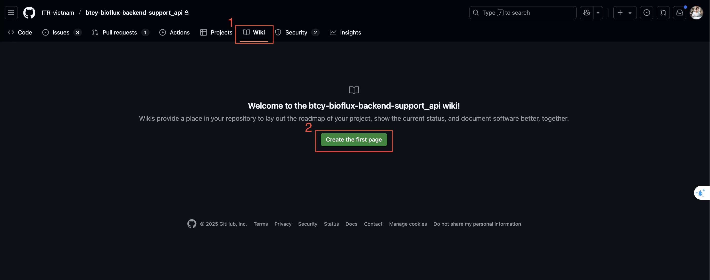

# 📚 Project Wiki Home

Welcome to the official Wiki for **My Project**. Here you'll find all the essential guides, references, and tips to get started and use the project efficiently.

---

## 📖 Table of Contents

- [Installation](install-0home)
  - [Clone the Repository](install-clone)
  - [Create a Wiki Page](install-create)
  - [Push Changes](install-push)
- [Usage](usage-0home)
  - [Markdown Syntax](usage-markdown)
  - [Embed Images](usage-images)
  - [Link Pages](usage-link)
  - [Table of Contents](usage-toc)
  - [`.md` Files and Images](usage-md-and-image)

---

## 🧩 Quick Start

Follow our [Installation Guide](install-home) to set up the project locally.



---

## 🚀 Useful Links

- [Official Repository](https://github.com/orgs/ITR-vietnam/projects/23)
- [Issue Tracker](https://github.com/orgs/ITR-vietnam/projects/23/views/80)
- [Releases](https://github.com/orgs/ITR-vietnam/projects/23/views/23)

---

## 🐞 Troubleshooting

### Issue: Organizing GitHub Wiki Files and Images

[Link to Solution](usage-md-and-image)

### Issue: Images not showing on Wiki  

✅ **Solution:** Make sure to add, commit, and push the `images/` folder.

```bash
git add images/
git commit -m "Add images"
git push
```
