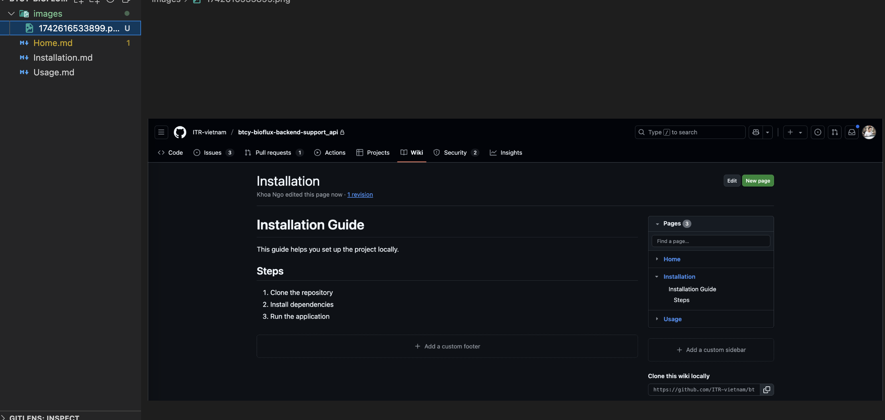

# Embed Images in Wiki Pages

This guide shows how to embed images in your GitHub Wiki using local image files or external URLs.

---

## Option 1: Local Images (Recommended)

1. **Create an `images/` Folder**
   - Inside your cloned Wiki repository, create a folder named `images/`.
   - Add all image files into this folder.

   

2. **Embed Image Using Markdown**
   - Use relative paths to link images in your `.md` files:

     ```markdown
     
     ```

   

> ⚠️ **Note**: After adding images, commit and push them so they appear correctly on GitHub Wiki.

```bash
git add images/
git commit -m "Add images for Wiki"
git push
```

---

## Option 2: External Image URLs

- You can embed images hosted externally by using their URL:

    ```markdown
    
    ```

> ✅ Useful for sharing dynamic or hosted images from external sources.
